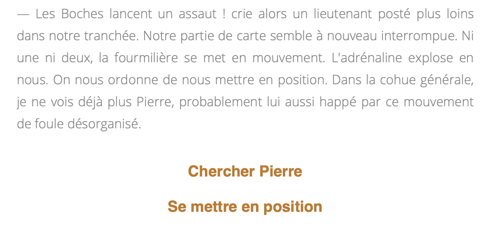

# *Un nez aquilin*
## Description
*English below*

*Un nez aquilin* est un projet de jeu vidéo prenant la forme d'une fiction interactive, développé avec le langage de script [Ink](https://www.inklestudios.com/ink/). L'histoire plonge le lecteur/joueur dans le quotidien d'un soldat de la première guerre mondiale blessé à la face. Il permet de faire l'expérience de la vie des "gueules cassées", nom donné aux soldats ayant reçu des blessures au visage et qui, face au regard de la société, ont subi  un traumatisme autant psychologique que physique. Cette fiction interactive s'inspire d'*Hommes sans visage*(1942), témoignage d'Henriette Rémi, volontaire dans un hôpital pour blessés de la face durant la première guerre mondiale. Le jeu prend également comme source d'inspiration le roman de Marc Dugain <i>La Chambre des officiers</i> (1998).

--- 

*Un nez aquilin* is a video game project in the form of an interactive fiction, developed with the scripting language [Ink] (https://www.inklestudios.com/ink/). The story immerses the reader/player in the daily life of a soldier of the First World War wounded in the face. It allows you to experience the life of the "gueules cassées" (broken faces), the name given to soldiers who have received facial wounds and who have suffered both psychological and physical trauma. This interactive fiction is inspired by * Hommes sans visage * (1942), testimony of Henriette Rémi, volunteer in a hospital for facially disfigured servicemen during the First World War. The game also takes as a source of inspiration the novel by Marc Dugain *La Chambre des officers* (1998).

## Captures 

L'histoire commence dans les tranchées des troupes françaises.

## Installation 
 Télécharger le dossier (avec le bouton "Clone or download") et ouvrir le fichier intitulé "index.html" dans un navigateur web.

## Avertissement
Le jeu n'est actuellement pas terminé.

## Références
- RÉMI, Henriette, *Hommes sans visages*, postface historique de Stéphane Garcia, Genève, Slatkine, 2014 (publication originale en 1942).
- DUGAIN, Marc, *La chambre des officiers*, Editions Jean-Claude Lattès, 1998.

## Contexte de développement 
Ce projet a été développé par Jeremy Chaumont dans le cadre du cours "Développement de jeux vidéo 2D", dispensé par Isaac Pante (Section SLI, Faculté des Lettres, Université de Lausanne) - Printemps 2021.
